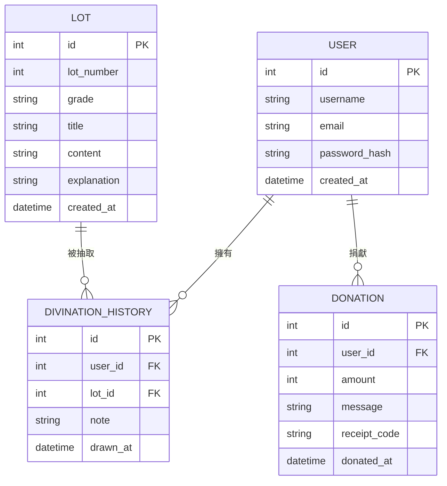

# 資料庫設計文件 (線上算命系統)

本文件依據 PRD.md、ARCHITECTURE.md 與 FLOWCHART.md，定義系統所需的 SQLite 資料表結構、欄位說明與資料表關聯（ER 圖）。

---

## 1. ER 圖（實體關係圖）

---

## 2. 資料表詳細說明

### 2.1 `user` — 會員資料表

儲存所有已註冊的使用者資訊，用於登入驗證與關聯個人紀錄。

| 欄位名稱 | 型別 | 必填 | 說明 |
|---|---|---|---|
| `id` | INTEGER | ✅ | Primary Key，自動遞增 |
| `username` | TEXT | ✅ | 使用者顯示名稱，需唯一 |
| `email` | TEXT | ✅ | 電子郵件，用於登入，需唯一 |
| `password_hash` | TEXT | ✅ | 使用 bcrypt 雜湊過的密碼，不存明文 |
| `created_at` | DATETIME | ✅ | 帳號建立時間，預設為當下時間 |

- **Primary Key**：`id`
- **Unique 約束**：`email`、`username`

---

### 2.2 `lot` — 籤詩內容資料表

儲存系統預設的所有籤詩內容，由管理員後台維護。

| 欄位名稱 | 型別 | 必填 | 說明 |
|---|---|---|---|
| `id` | INTEGER | ✅ | Primary Key，自動遞增 |
| `lot_number` | INTEGER | ✅ | 籤號（如第 1 支、第 2 支），需唯一 |
| `grade` | TEXT | ✅ | 籤等（上上籤、上籤、中籤、下籤、大凶籤） |
| `title` | TEXT | ✅ | 籤詩標題（如：「春風得意馬蹄疾」） |
| `content` | TEXT | ✅ | 籤詩全文（文言文原文） |
| `explanation` | TEXT | ✅ | 籤詩白話文解說，系統展示給使用者的說明 |
| `created_at` | DATETIME | ✅ | 籤詩資料建立時間，預設為當下時間 |

- **Primary Key**：`id`
- **Unique 約束**：`lot_number`

---

### 2.3 `divination_history` — 抽籤歷史紀錄資料表

記錄每位會員每次抽籤的結果，用於「查看歷史紀錄」功能。

| 欄位名稱 | 型別 | 必填 | 說明 |
|---|---|---|---|
| `id` | INTEGER | ✅ | Primary Key，自動遞增 |
| `user_id` | INTEGER | ✅ | Foreign Key → `user.id`，哪位會員抽的 |
| `lot_id` | INTEGER | ✅ | Foreign Key → `lot.id`，抽到哪支籤 |
| `note` | TEXT | ❌ | 使用者自填的備註（問卜的問題或心情） |
| `drawn_at` | DATETIME | ✅ | 抽籤時間，預設為當下時間 |

- **Primary Key**：`id`
- **Foreign Keys**：`user_id` → `user(id)`，`lot_id` → `lot(id)`

---

### 2.4 `donation` — 香油錢捐獻紀錄資料表

記錄每筆使用者的捐獻紀錄，並儲存感謝祝福語與數位收據代碼。

| 欄位名稱 | 型別 | 必填 | 說明 |
|---|---|---|---|
| `id` | INTEGER | ✅ | Primary Key，自動遞增 |
| `user_id` | INTEGER | ❌ | Foreign Key → `user.id`，可為 NULL（匿名捐獻） |
| `amount` | INTEGER | ✅ | 捐獻金額（單位：新台幣元） |
| `message` | TEXT | ❌ | 捐獻者填寫的祝福語 |
| `receipt_code` | TEXT | ✅ | 系統產生的唯一捐款收據識別碼（UUID） |
| `donated_at` | DATETIME | ✅ | 捐獻時間，預設為當下時間 |

- **Primary Key**：`id`
- **Foreign Keys**：`user_id` → `user(id)`（允許 NULL，支援匿名捐獻）

---

## 3. 資料表關聯說明

| 關聯 | 類型 | 說明 |
|---|---|---|
| `user` → `divination_history` | 一對多 | 一個使用者可以擁有多筆抽籤紀錄 |
| `lot` → `divination_history` | 一對多 | 一支籤可以被不同使用者在不同時間抽到 |
| `user` → `donation` | 一對多 | 一個使用者可以有多筆香油錢捐獻紀錄 |
