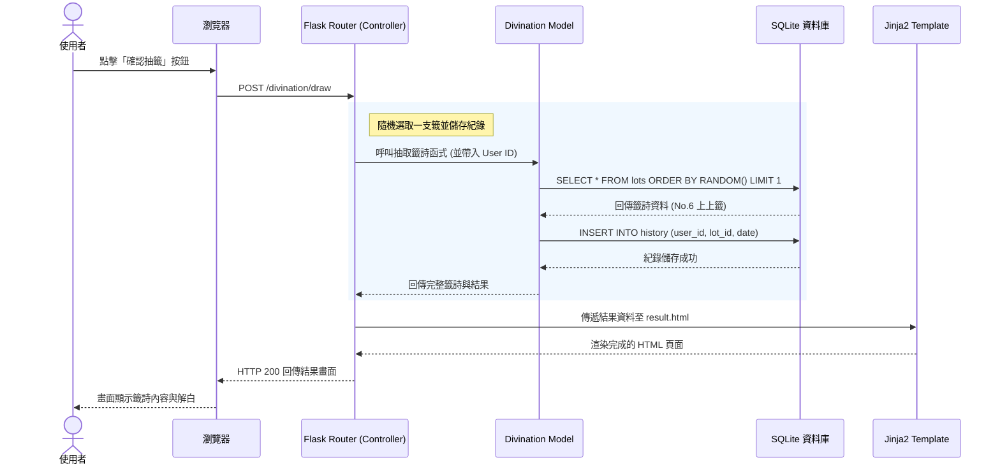

# 流程圖與系統規劃文件 (線上算命系統)

本文件根據專案的 PRD 與 ARCHITECTURE 文件，視覺化展示使用者的操作流向與系統內部的資料處理流程，並列出基礎的功能路由對照表。

## 1. 使用者流程圖（User Flow）

以下流程圖展示了使用者進入網站後，可能進行的幾項主要操作路徑（包含會員註冊、線上抽籤、查看紀錄與捐獻香油錢）。

```mermaid
flowchart LR
    Start([使用者首度開啟網頁]) --> Home[首頁 (顯示每日運勢與入口)]
    
    Home --> Choice{要執行什麼操作？}
    
    %% 註冊登入流程
    Choice -->|尚未登入| Auth[點擊登入/註冊]
    Auth --> FillAuth[填寫帳號密碼表單]
    FillAuth -->|成功| Home
    
    %% 抽籤流程
    Choice -->|求神問卜| DrawLot[點擊「線上抽籤」]
    DrawLot --> CastBlocks[進行線上擲筊動畫]
    CastBlocks -->|聖筊| ShowResult[顯示抽籤結果與籤詩]
    CastBlocks -->|笑筊/陰筊| CastBlocks
    ShowResult --> Share[點擊分享至社群]
    ShowResult --> Home
    
    %% 歷史紀錄流程
    Choice -->|回顧| History[點擊「歷史紀錄」]
    History --> ViewHistory[列表顯示過去的所有占卜結果]
    ViewHistory --> Home
    
    %% 捐款流程
    Choice -->|答謝神明| Donate[點擊「香油錢捐獻」]
    Donate --> FillDonate[填寫捐款金額與祝福語]
    FillDonate --> SuccessDonate[顯示感謝頁面與數位收據]
    SuccessDonate --> Home
```

## 2. 系統序列圖（Sequence Diagram）

以下序列圖描述使用者進行「線上抽籤」並將結果存入資料庫的完整技術流向。



## 3. 功能清單對照表

依照專案架構（`app/routes/` 的藍圖規劃），以下為功能的網址路徑 (URL) 與 HTTP 方法對照：

| 功能描述 | URL 路徑 | HTTP 方法 | 對應的 Router (Blueprint) |
| -------- | -------- | --------- | ------------------------- |
| **首頁 / 每日運勢** | `/` | GET | `main.py` |
| **會員註冊頁面** | `/auth/register` | GET | `auth.py` |
| **處理會員註冊送出** | `/auth/register` | POST | `auth.py` |
| **會員登入頁面** | `/auth/login` | GET | `auth.py` |
| **處理會員登入送出** | `/auth/login` | POST | `auth.py` |
| **會員登出** | `/auth/logout` | GET / POST | `auth.py` |
| **進入抽籤/擲筊頁面** | `/divination/draw` | GET | `divination.py` |
| **處理抽籤動作 (擲筊)**| `/divination/draw` | POST | `divination.py` |
| **查看個人的歷史紀錄** | `/divination/history` | GET | `divination.py` |
| **進入捐獻香油錢頁面** | `/donation/donate` | GET | `donation.py` |
| **處理捐款表單送出** | `/donation/donate` | POST | `donation.py` |
| **捐款成功之感謝頁面** | `/donation/success` | GET | `donation.py` |
